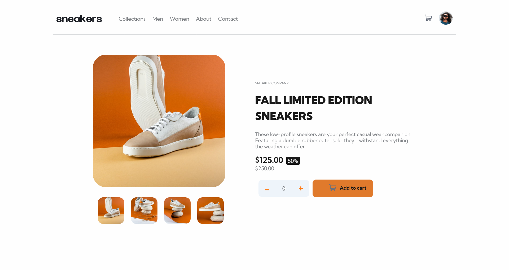

# Frontend Mentor - E-commerce product page solution

This is a solution to the [E-commerce product page challenge on Frontend Mentor](https://www.frontendmentor.io/challenges/ecommerce-product-page-UPsZ9MJp6). Frontend Mentor challenges help you improve your coding skills by building realistic projects.

## Table of contents

- [Overview](#overview)
  - [The challenge](#the-challenge)
  - [Screenshot](#screenshot)
  - [Links](#links)
- [My process](#my-process)
  - [Built with](#built-with)
  - [What I learned](#what-i-learned)
  - [Continued development](#continued-development)
- [Author](#author)

## Overview

This is an amazing project to do to improve some core frontend design skills like mastering flexboxes and spacing and adding functionality with JavaScript.

### The challenge

In building this project, I was able

- create the hover states for all interactive elements on the page
- create a lightbox gallery by clicking on the large product image
- implement the function to switch the large product image by clicking on the small thumbnail images

### Screenshot

### Links

- Solution URL: [My solution]([https://e-commerce-product-page-solution-ten.vercel.app/#](https://github.com/Chinwenmeri/E-commerce-product-page-solution)
- Live Site URL: [Live URL to project](https://e-commerce-product-page-solution-ten.vercel.app/#)

## My process

### Built with

- Semantic HTML5 markup
- CSS custom properties
- Flexbox

### What I learned

I better practised flex boxes and handled adding functionality to elements in Javascript.
I worked for the first time with the dialog tag and this was interesting as I would be working with it more to better understand it and perfect the usage.

### Continued development

In this project and in subsequent projects, I intend to better understand the Javascript aspects of the projects I intend to work on.
Also to understand the logic behind how the cart works as I wasn't able to implement that function on this project. I also want to better understand how responsiveness works so to add them with more intentionality to the project I would be building in the future.

## Author

- Frontend Mentor - [@Chinwemeri](https://www.frontendmentor.io/profile/Chinwenmeri)
- Twitter - [@Chinwenmeri3](https://x.com/Chinwenmeri3)

**Note: Delete this note and add/remove/edit lines above based on what links you'd like to share.**
